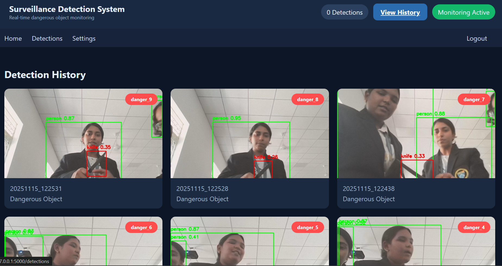

# Real-Time Weapon Detection for Surveillance System

## Overview
This project is a real-time object detection surveillance system designed to detect weapons such as guns and knives from live video streams.  
The system uses a YOLO (You Only Look Once) deep learning model trained on a custom dataset in PASCAL VOC format and is integrated with a Flask web application for real-time monitoring.

The aim of this project is to improve safety in surveillance environments by automatically identifying potential threats.

---

## Features
- Real-time detection of guns and knives
- YOLO-based deep learning object detection
- Trained on a custom PASCAL VOC dataset
- Live video stream processing
- Flask-based web interface
- Bounding boxes with class labels and confidence scores
- Optimized for real-time performance

---

## Technologies Used
- Python
- YOLO
- OpenCV
- Flask
- Deep Learning
- PASCAL VOC Dataset
- NumPy

---

## Dataset
- Custom dataset annotated in PASCAL VOC format
- Classes included:
  - gun
  - knife
- Dataset used to train a YOLO-based weapon detection model

---

## Model Training
- YOLO model trained on a weapon-specific dataset
- Custom object classes defined for gun and knife
- Trained weights integrated into the detection system
- Model optimized for real-time surveillance applications

---

## System Architecture
1. Video input from webcam or CCTV feed
2. Frame processing using OpenCV
3. Weapon detection using YOLO model
4. Detection results passed to Flask backend
5. Real-time display on web interface

---

## How to Run the Project

### Step 1: Clone the Repository
```bash
git clone https://github.com/lakshi008/Realtime-object-detection.git
cd Realtime-object-detection

